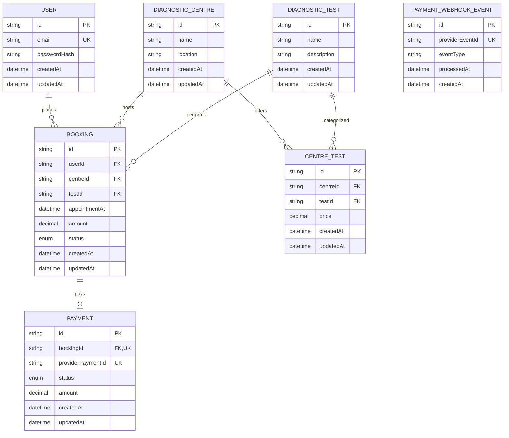
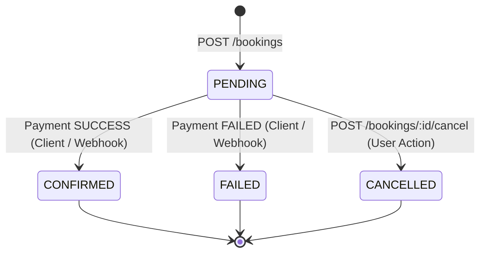

# EVE Healthcare — Backend Engineering System

A production-ready, modular JavaScript backend built with **Node.js, Express, PostgreSQL, and Prisma ORM** for diagnostic centre test management, appointment slot booking, and simulated payment processing with robust webhook idempotency and database-enforced concurrency safety.

---

## Table of Contents

1. [Architecture & Design Philosophy](#architecture--design-philosophy)
2. [Tech Stack](#tech-stack)
3. [Key Engineering Decisions & Assumptions](#key-engineering-decisions--assumptions)
4. [Database Schema & Entity Relations](#database-schema--entity-relations)
5. [Concurrency Safety & Slot Model](#concurrency-safety--slot-model)
6. [Booking State Machine](#booking-state-machine)
7. [Payment Flow & Webhook Idempotency](#payment-flow--webhook-idempotency)
8. [API Reference](#api-reference)
9. [Error Handling Strategy](#error-handling-strategy)
10. [Environment Configuration](#environment-configuration)
11. [Setup & Running Locally](#setup--running-locally)
12. [Running with Docker](#running-with-docker)
13. [Testing Guide](#testing-guide)
14. [Security Audit](#security-audit)
15. [Tradeoffs & Future Improvements](#tradeoffs--future-improvements)

---

## Architecture & Design Philosophy

The system is structured as a **Modular Monolith** using Express and Prisma, optimized for maintainability, explainability, and testability.

```
src/
├── app.js                  # Express application factory, middleware, & route mounting
├── server.js               # Server entrypoint with graceful shutdown
├── config/
│   └── env.js              # Centralized environment variable validation (Zod)
├── db/
│   └── prisma.js           # Prisma client singleton
├── plugins/
│   ├── auth.js             # Express JWT authentication middleware
│   ├── error-handler.js    # Express 4-argument centralized error middleware
│   └── swagger.js          # Swagger UI integration via swagger-ui-express & swagger-jsdoc (/docs)
├── common/
│   ├── errors/             # Domain error classes (NotFoundError, ConflictError, etc.)
│   ├── security/           # Isolated Argon2 password hashing & jose JWT signing/verification
│   └── utils/              # Minimal utilities (asyncHandler)
└── modules/
    ├── auth/               # User signup, login, auth repository & service
    ├── centres/            # Diagnostic centres, centre repository & service
    ├── tests/              # Diagnostic test catalogue, test repository & service
    ├── bookings/           # Appointment slot bookings, booking state machine & repository
    └── payments/           # Payment execution, webhook idempotency, payment repository
```

### Layer Responsibilities (4-Tier Architecture)

```
Express Route  ──>  Service Layer  ──>  Repository Layer  ──>  Prisma Client  ──>  PostgreSQL
```

- **Routes (`*.route.js`)**: Express routers handling HTTP parsing, payload validation with Zod schemas, auth middleware invocation, and response serialization via `asyncHandler`.
- **Services (`*.service.js`)**: Pure business logic, authorization rules, orchestration across repositories, transaction lifecycle management (`prisma.$transaction`), and error mapping. Services contain zero direct database queries.
- **Repositories (`*.repository.js`)**: Concrete data access layer containing explicit, encapsulated Prisma queries. Every repository method supports optional transaction clients (`db = prisma`) to enable multi-step ACID transactions across services.
- **Security (`src/common/security/`)**: Dedicated cryptographic modules isolating password hashing (`password.js` using Argon2) and token management (`jwt.js` using jose).
- **State Machines (`booking.state.js`)**: Centralized state transition table and transition validator for booking lifecycles (`PENDING` -> `CONFIRMED` / `FAILED` / `CANCELLED`).
- **Prisma Client (`src/db/prisma.js`)**: Relational database query engine and connection pool manager.

---

## Tech Stack

| Technology | Role |
| :--- | :--- |
| **Node.js** (v20+) | JavaScript runtime (ES Modules) |
| **Express** | HTTP web framework |
| **PostgreSQL** | Primary relational database |
| **Prisma ORM** | Schema migrations and transactional database queries |
| **Zod** | Runtime input validation and environment parsing |
| **Argon2** | Secure password hashing (Argon2id) |
| **jose** | Standards-compliant JWT signing and verification |
| **Helmet & CORS** | HTTP security headers and cross-origin resource sharing |
| **Pino & Pino-HTTP** | Structured request/response logging |
| **Swagger UI Express** | Interactive OpenAPI documentation (`/docs`) |
| **Vitest & Supertest** | Automated unit and integration testing suite |
| **Docker & Docker Compose** | Containerized deployment |

---

## Key Engineering Decisions & Assumptions

1. **User = Patient**: The `User` model represents both the authenticated account and the patient.
2. **Historical Price Snapshot**: The `Booking.amount` is explicitly captured at creation time from `CentreTest.price`. Historical bookings never reference dynamic centre prices to prevent price drift if a centre updates test pricing later.
3. **Appointment Slot Model**:
   - `appointmentAt` is an exact ISO 8601 timestamp representing the appointment schedule.
   - A single centre can run multiple *different* tests simultaneously (e.g. an MRI and a Blood Test at 10:00 AM).
   - However, a centre cannot run the *same* test at the same timestamp twice.
   - The active slot uniqueness is scoped to `(centreId, testId, appointmentAt)` for bookings with status `PENDING` or `CONFIRMED`.
4. **Monetary Precision**: All currency amounts use PostgreSQL `DECIMAL(10, 2)` (Prisma `Decimal`). Floating-point arithmetic is strictly avoided for money.

---

## Database Schema & Entity Relations



---

## Concurrency Safety & Slot Model

Concurrency safety is enforced at the database engine level using a **PostgreSQL Partial Unique Index**:

```sql
CREATE UNIQUE INDEX "unique_active_booking_slot" 
ON "bookings"("centreId", "testId", "appointmentAt") 
WHERE "status" IN ('PENDING', 'CONFIRMED');
```

- When Request A and Request B race for the same slot:
  - Request A inserts successfully (`201 Created`).
  - Request B triggers a unique constraint violation (`P2002`), which is caught and returned as a clean `409 Conflict` (`BOOKING_SLOT_UNAVAILABLE`).
- If a booking is `CANCELLED` or `FAILED`, the slot becomes immediately available for other users to book because the partial index only locks `PENDING` and `CONFIRMED` rows.

---

## Booking State Machine



### Transition Rules

- `PENDING -> CANCELLED`: Triggerable by the booking owner via `POST /bookings/:id/cancel`.
- `PENDING -> CONFIRMED`: Triggerable only via successful payment or webhook event.
- `PENDING -> FAILED`: Triggerable only via failed payment or webhook event.
- Invalid transitions (e.g. attempting to cancel a `CONFIRMED` or `CANCELLED` booking, or applying payment to a `CANCELLED` booking) immediately reject with `409 Conflict` (`INVALID_BOOKING_STATE`).

### Concurrency Safety on State Transitions (Optimistic Locking / Conditional Updates)
To prevent race conditions between simultaneous payment processing and cancellation requests:
- State transitions are executed via atomic conditional updates (`UPDATE bookings SET status = $target WHERE id = $id AND status = 'PENDING'`).
- The repository layer executes this atomically (`BookingRepository.transitionStatus`), verifying that `affectedRows === 1`.
- If a simultaneous cancel and payment request arrive, exactly one will update the row; the losing request observes `affectedRows === 0` and is cleanly aborted with `409 Conflict` (`INVALID_BOOKING_STATE`), preventing any invalid dual state.

---

## Payment Flow & Webhook Idempotency

### 1. Simulated Client Payments (`POST /payments`)

- Authenticated patient submits `bookingId` and `providerPaymentId`.
- Amount is automatically pulled from the booking snapshot (cannot be altered by client).
- Ownership is verified (`booking.userId === req.user.id`).
- Within a Prisma transaction, creates the payment record and transitions booking to `CONFIRMED` or `FAILED`.

### 2. Provider Webhook Handling (`POST /payments/webhook`)

1. **Atomic Deduplication**: `PaymentWebhookEvent.providerEventId` has a unique constraint.
2. **Idempotent Acknowledgment**:
   - First delivery: records event, verifies booking, creates payment, updates booking status within an atomic transaction, returning `{ received: true, status: "processed" }`.
   - Repeated delivery: acknowledges immediately with `200 OK` and `{ received: true, status: "already_processed" }`.
   - Concurrent delivery: database uniqueness resolves race safely, exactly 1 payment created, both return `200 OK`.
3. **Conflict Detection**: Conflicting statuses return `409 Conflict` (`PAYMENT_CONFLICT`).

---

## API Reference

Interactive Swagger documentation is available at `http://localhost:3000/docs`.

### Authentication

| Method | Endpoint | Description | Auth |
| :--- | :--- | :--- | :--- |
| `POST` | `/auth/signup` | Register a new user account | Public |
| `POST` | `/auth/login` | Authenticate and receive JWT token | Public |
| `GET` | `/auth/me` | Retrieve authenticated user profile | Bearer JWT |

### Diagnostic Centres & Tests

| Method | Endpoint | Description | Auth |
| :--- | :--- | :--- | :--- |
| `POST` | `/centres` | Create diagnostic centre | ADMIN (Bearer JWT) |
| `GET` | `/centres` | List diagnostic centres (paginated: `?page=1&limit=20`) | Public |
| `GET` | `/centres/:id` | Get centre details with available tests & pricing | Public |
| `POST` | `/tests` | Create diagnostic test | ADMIN (Bearer JWT) |
| `GET` | `/tests` | List diagnostic tests (paginated) | Public |
| `GET` | `/tests/:id` | Get test details with offering centres | Public |
| `POST` | `/centres/:id/tests` | Assign test to centre with centre-specific price | ADMIN (Bearer JWT) |
| `GET` | `/centres/:id/tests` | List all tests offered by a centre | Public |

### Bookings

| Method | Endpoint | Description | Auth |
| :--- | :--- | :--- | :--- |
| `POST` | `/bookings` | Book an appointment slot | Bearer JWT |
| `GET` | `/bookings` | List authenticated user's bookings (`?page=1&limit=20&status=PENDING`) | Bearer JWT |
| `GET` | `/bookings/:id` | Get booking details (owner only) | Bearer JWT |
| `POST` | `/bookings/:id/cancel` | Cancel a pending booking (owner only) | Bearer JWT |

### Payments

| Method | Endpoint | Description | Auth |
| :--- | :--- | :--- | :--- |
| `POST` | `/payments` | Process simulated payment for a booking | Bearer JWT |
| `GET` | `/payments/booking/:id` | View payment details for a booking (owner only) | Bearer JWT |
| `POST` | `/payments/webhook` | Handle payment gateway webhook event | Public (Idempotent) |

---

## Error Handling Strategy

All errors follow a unified, predictable JSON envelope:

```json
{
  "error": {
    "code": "BOOKING_SLOT_UNAVAILABLE",
    "message": "The selected appointment slot is already booked"
  }
}
```

---

## Setup & Running Locally

### 1. Install Dependencies

```bash
npm install
```

### 2. Configure Environment

```bash
cp .env.example .env
```

### 3. Run Database Migrations

```bash
npm run prisma:migrate
```

### 4. Start Development Server

```bash
npm run dev
```

The server will start at `http://localhost:3000`. Swagger API docs are available at `http://localhost:3000/docs`.

---

## Running with Docker

```bash
docker compose up -d --build
```

---

## Testing Guide

```bash
npm test
```

### Complete Test Matrix (55 / 55 Passing)

```
Test Files  5 passed (5)
     Tests  55 passed (55)

✓ tests/integration/payments.test.js      (14 tests)
✓ tests/integration/bookings.test.js      (14 tests)
✓ tests/integration/centres-tests.test.js (17 tests)
✓ tests/integration/auth.test.js          (7 tests)
✓ tests/unit/auth.service.test.js         (3 tests)
```

- **Authentication**: Signup, duplicate email rejection (409), login, invalid credentials (401), missing/invalid JWT (401), protected profile retrieval.
- **Centres & Tests**: Create centre/test, list centres/tests (public), add test with custom price, duplicate test assignment rejection (409), unauthorized mutation rejection (401), standard USER role forbidden (403), ADMIN authorized creation (201).
- **Bookings**: Authenticated booking creation with historical price snapshot, past appointment rejection (400), nonexistent centre/test rejection (404), test unoffered by centre (404), sequential slot collision (409), concurrent race condition slot collision (409), user isolation / cross-tenant access rejection (403), invalid UUID (400), nonexistent booking (404), booking cancellation (200), cancel confirmed/cancelled booking rejection (409).
- **Payments**: Successful payment transitioning to `CONFIRMED`, failed payment transitioning to `FAILED`, unauthorized user payment rejection (403), duplicate payment on confirmed booking rejection (409), duplicate `providerPaymentId` rejection (409), payment for cancelled booking rejection (409), concurrent payment vs cancellation race condition resolution (only one succeeds).
- **Webhooks**: First delivery processing (`processed`), repeated delivery idempotency (`already_processed`), identical webhook repeated 10 times with zero duplicate payments, concurrent identical webhook safety, malformed payload rejection (400), nonexistent booking rejection (404), conflicting status rejection (409).
